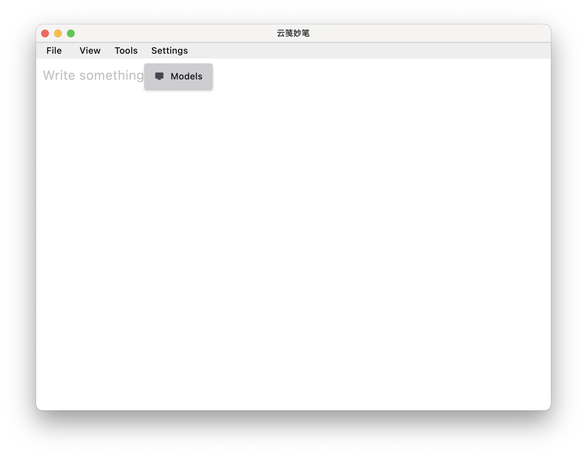
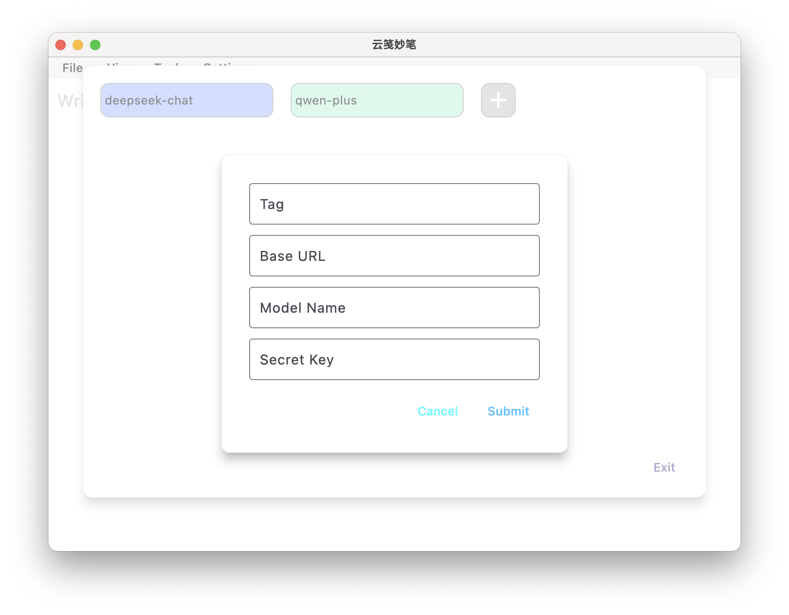
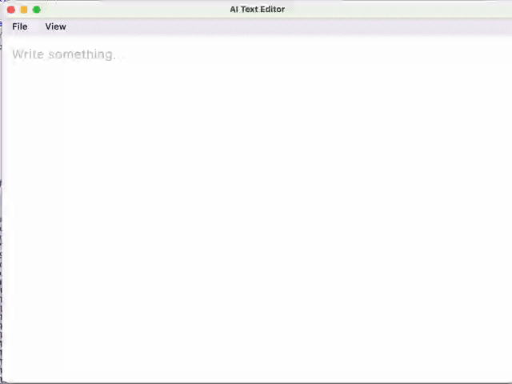

# ai_text_editor

## Instruction Is All You Need

using `flutter` and `flutter_quill` to build a text editor

### Before use

**add AI model (only support OpenAI api)**

### Features

- AI generate with instruction

- Table generate  with instruction

- spell check with AI

- try `<roll></roll>`