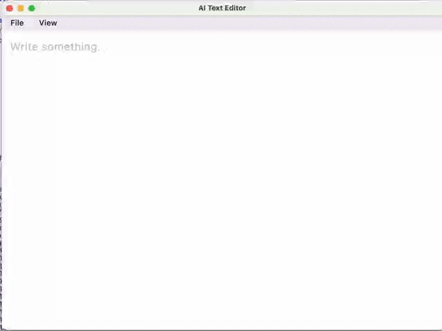

# 云笺妙笔 (AI Text Editor)

> **🚧 项目重构中** - 正在使用 [Kiro AI](https://kiro.dev) 进行全面重构，从单一文本编辑器升级为个人知识管理工具

## 项目愿景

打造一个集成多种效率工具的**个人知识管理平台**，让知识的采集、整理、创作和管理变得更加智能化。

### 🎯 核心理念
- **指令即一切** - 通过自然语言指令驱动所有功能
- **本地优先** - 支持本地 AI 模型，保护隐私
- **工具集成** - 统一入口管理多种效率工具
- **知识连接** - 智能关联和组织知识内容

## 🚀 当前功能

### 📝 智能文本编辑
基于 `flutter_quill` 构建的富文本编辑器，支持：

- **AI 内容生成** - 通过指令生成文本内容
- **表格智能生成** - 自然语言描述生成表格
- **AI 拼写检查** - 智能语法和拼写纠错
- **特殊标签** - 支持 `<roll></roll>` 等自定义标签


### 🎤 语音转录工具 (新增)
**本地 ASR 引擎** - 基于 sherpa_onnx 实现：

- **实时流式识别** - 边说边转录，支持中英文
- **本地处理** - 无需联网，保护隐私
- **AI 优化润色** - 转录后可调用 AI 优化文本
- **智能摘要** - 自动生成内容要点
- **工作空间集成** - 直接保存到知识库

### 🔍 深度搜索 (规划中)
- 多源信息聚合搜索
- 搜索结果智能摘要
- 一键保存到知识库

### 🛠️ 统一工具面板
- 右下角浮动按钮快速访问
- AI 问答、语音转录、深度搜索集成
- 工具间无缝切换

## 🔧 技术栈

- **前端框架**: Flutter
- **文本编辑**: flutter_quill
- **语音识别**: sherpa_onnx (本地 ASR)
- **AI 集成**: OpenAI API + 本地模型支持
- **状态管理**: Riverpod
- **开发工具**: Kiro AI 辅助重构

## 📦 安装使用

### 环境要求
- Flutter 3.0+
- Dart 3.0+

### 快速开始

1. **克隆项目**
```bash
git clone https://github.com/xiaoshuyui/ai_text_editor.git
cd ai_text_editor
```

2. **安装依赖**
```bash
flutter pub get
```

3. **配置语音识别模型** (可选)
   
   下载 sherpa_onnx 模型并配置路径：
   ```json
   {
     "asr": {
       "online": {
         "modelDir": "path/to/your/model",
         "modelType": "zipformer"
       }
     }
   }
   ```

2. **运行应用**
```bash
flutter run
```

## 🎯 重构进展

### ✅ 已完成
- [x] 统一工具面板架构
- [x] 语音转录 UI 框架
- [x] 本地 ASR 引擎集成 (sherpa_onnx)
- [x] 流式语音识别实现
- [x] AI 优化和摘要功能

### 🚧 进行中
- [ ] 语音转录服务连接调试
- [ ] 工作空间保存功能
- [ ] 深度搜索工具开发

### 📋 规划中
- [ ] 模型管理界面
- [ ] 搜索历史服务
- [ ] 知识图谱可视化
- [ ] 多语言支持
- [ ] 插件系统

## 🎨 界面预览

### AI 内容生成


### 表格生成


### 拼写检查


## 🤝 参与贡献

项目正在积极开发中，欢迎提交 Issue 和 PR！

### 开发说明
- 使用 Kiro AI 进行代码重构和功能开发
- 遵循 Flutter 最佳实践
- 优先考虑用户体验和性能

## 📄 许可证

MIT License - 详见 [LICENSE](LICENSE) 文件

---

> 💡 **提示**: 这是一个个人知识管理工具的早期版本，功能还在快速迭代中。如果你对项目感兴趣，欢迎 Star 关注最新进展！